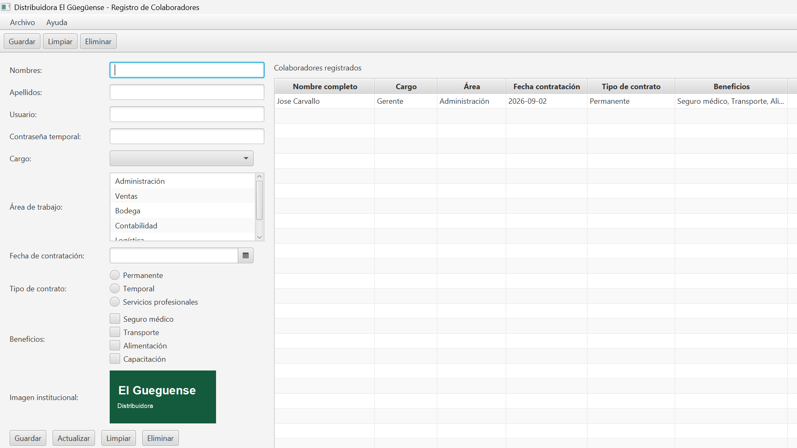

# Distribuidora El Güegüense — Sistema de Registro de Colaboradores

Aplicación de escritorio en **JavaFX** (FXML + Scene Builder) para registrar y consultar
la información básica de los colaboradores de la empresa. Los datos se almacenan
temporalmente en una `ObservableList` (sin base de datos).

## Integrantes

| Nombre completo | Usuario GitHub                 | Aporte principal |
|-----------------|--------------------------------|------------------|
| _Integrante 1_  | _José Cristo Carvallo Herrera_ | Modelo `Colaborador`, controlador y eventos |
| _Integrante 2_  | _Jesy Nicole Gonzalez Jarquin_ | Interfaz FXML, validaciones y menús |

## Funcionalidad

- **CRUD:** registrar, mostrar, seleccionar, actualizar y eliminar colaboradores.
- **Controles:** `Label`, `Button`, `TextField`, `PasswordField`, `ComboBox`, `ListView`,
  `DatePicker`, `RadioButton`, `CheckBox`, `ImageView`, `TableView`.
- **Validaciones:**
  - Ningún campo puede quedar vacío.
  - El usuario debe tener al menos 5 caracteres.
  - La contraseña temporal debe tener al menos 8 caracteres.
  - La fecha de contratación no puede ser posterior a la fecha actual.
  - Se debe seleccionar al menos un beneficio.
- **Eventos:**
  - `ActionEvent`: botones Guardar, Actualizar, Limpiar y Eliminar.
  - `MouseEvent`: doble clic en una fila de la tabla carga los datos en el formulario.
  - `KeyEvent`: **Enter** guarda y **Escape** limpia el formulario.
- **Menús:**
  - `MenuBar`: Nuevo, Salir, Acerca de.
  - `ToolBar`: Guardar, Limpiar, Eliminar.
  - `ContextMenu` sobre la tabla: Editar y Eliminar.

## Estructura

```
src/main/java/ni/edu/uam/c2distribuidoraelgueguense/
├── App.java                 # Application: carga el FXML
├── Launcher.java             # Punto de entrada alterno
├── controllers/ColaboradorController.java
├── models/Colaborador.java
└── utils/
    ├── Validador.java
    └── Alertas.java
src/main/resources/ni/edu/uam/c2distribuidoraelgueguense/
├── views/colaborador-view.fxml
└── images/logo.png
```

## Requisitos

- JDK 21
- Maven (incluye el wrapper `mvnw`)
- JavaFX 21.0.6 (lo descarga Maven automáticamente)
- Scene Builder (opcional, para editar el FXML)

## Cómo ejecutar

**Terminal:**

```bash
./mvnw.cmd clean javafx:run
```

**IntelliJ IDEA:** abrir la carpeta, esperar la descarga de dependencias y ejecutar
la clase `Launcher` (o `App`).

**Editar la interfaz:** abrir
`src/main/resources/ni/edu/uam/c2distribuidoraelgueguense/views/colaborador-view.fxml`
con Scene Builder.

## Capturas

_Capturas de la aplicación en funcionamiento:_


- Ventana principal
- Mensaje de validación
- Alta / actualización / eliminación de un colaborador
- Menú *Acerca de* y `ContextMenu` de la tabla
